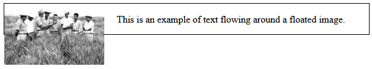
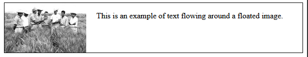
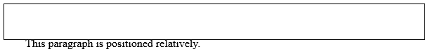
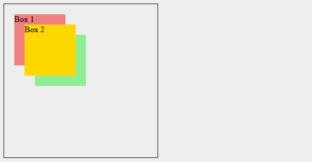

<div style="text-align: justify">

# 1. Understanding How to Work with Floats and Positioning in CSS

## 1.1. What are common use cases for using floats and how do they work?

Floats in CSS are a technique originally designed to allow text to wrap around an element, such as an image. Over time, however, developers found new ways to use floats, applying them to layout design in creative ways. While modern layout methods like Flexbox and Grid are now more commonly used, understanding floats is still important, especially when working with older code or needing to achieve specific layout effects.

When an element is floated, it's taken out of the normal document flow and pushed to the left or right of its container. The content that follows will wrap around the floated element, filling the remaining space. One classic use is wrapping text around images, where an image is floated to one side, and text wraps around it. This technique is still widely used, especially in articles and blogs where images need to be placed alongside text. Here is the code example:

```html
<body>
  <div class="container">
    
    <p> This is an example of text flowing around a floated image.</p>
  </div>
</body>
```

```css
.container {
    border: 1px solid black;
}

img {
    float: left;
    margin-right: 20px;
}
```

In the above example, the container doesn't wrap around the floated image. The image is out of the normal document flow, and the container collapsed to zero height because it doesn't "see" the floated children elements.

<div style="margin: 10px auto; width: 60%;">
    <p></p>
</div>

Floats were also popular for creating multi-column layouts before Flexbox and Grid became widespread. By floating elements next to each other, developers could create columns that aligned horizontally. However, when using floats, it's important to handle the problem of collapsing parent elements when their child elements are floated. The clearfix technique solution is applied to the class container element to fix this issue.

```css
/* Clearfix CSS */
.container::after {
    content: "";  
    display: block;
    clear: both;
}
```

*   `::after` is a pseudo-element that adds an invisible block after the content of the container.
*   `content: ""` ensures the pseudo-element is present but doesn’t display any content.
*   `display: block` makes the pseudo-element a block-level element.
*   `clear: both` ensures the pseudo-element clears both sides of any floated elements above it.

The clearfix technique ensures the parent element wraps around its floated children properly. Clearfix forces the parent container to "see" the floated child elements by adding a clear property after the floated content.

<div style="margin: 10px auto; width: 60%;">
    <p></p>
</div>

While floats are no longer the go-to method for complex layouts due to more modern techniques like Flexbox and Grid, they still play an essential role in certain scenarios. Whether you're wrapping text around images or working on legacy projects, understanding how floats work and how to clear them properly is key to maintaining well-structured and responsive layouts.


## 1.2. What is relative positioning and how does this differ from the default static positioning?

In CSS, positioning allows us to control how elements are laid out on a page. Two common types of positioning are static positioning and relative positioning. By default, elements are statically positioned. This means they follow the normal flow of the document, one after another, from top to bottom, left to right.

- **Static positioning** is the default for all elements and doesn't need any special declaration in CSS. You won’t notice anything different when using static positioning because it just keeps elements where they naturally occur in the document. Here is an example of a paragraph using default static positioning:

    ```html
    <p>This paragraph is statically positioned.</p>
    ```

    When rendered in the browser, this paragraph will appear in its natural position, following the normal document flow. No special styling is applied to move it, and it remains where it would naturally appear in the layout.

- **Relative positioning**, on the other hand, allows an element to be shifted from its normal position without disrupting the flow of the document. Think of it as moving the element from its default static position by giving it new coordinates. Here is how you might apply relative positioning:

    ```html
    <head>
        <style>
            body {
                border: solid 1px black;
            }
            .relative {
                position: relative;
                top: 30px;
                left: 30px;
            }
        </style>
    </head>
    <body>
        <p class="relative">This paragraph is positioned relatively.</p>
    </body>
    ```

    In this example, the paragraph will appear `30px` down and `30px` to the right from its original position. However, the space it would have occupied in the normal flow remains preserved. Relative positioning is very useful when you want to move an element slightly without affecting the rest of the layout.

    <div style="margin: 10px auto; width: 60%;">
        <p></p>
    </div>


## 1.3. What is absolute positioning and how does it work?

Absolute positioning allows you to take an element out of the normal document flow, making it behave independently from other elements. When an element is positioned absolutely, it is placed in its own layer, completely separate from everything else in the layout. This makes it useful for creating floating UI features such as modals, tooltips, or dropdown menus, which can overlap other elements on the page.

By default, absolutely positioned elements are placed relative to the closest positioned ancestor. If no positioned ancestor is found, the element will be positioned relative to the initial containing block, which is usually the browser's viewport. You can move the absolutely positioned element around using the `top`, `bottom`, `left`, and `right` properties to specify how far away it should be from the edges of its containing element.

For example, setting `top: 30px` and `left: 30px` will move the element `30px` away from the top and left edges of the containing block. Here's an example of how to apply absolute positioning to an element in CSS:

```html
<body style="background-color: #eeeeee;">
    <div class="positioned">Absolutely Positioned</div>
</body>
```

```css
.positioned {
    position: absolute;
    top: 30px;
    left: 30px;
    background-color: coral;
}
```

When this code is applied, the element will be removed from the normal document flow and placed `30px` away from the top and left of its containing block.

Absolute positioning can be especially helpful for creating elements that are meant to float over the rest of the content, like overlays or modal windows. However, since the element is removed from the document flow, it can also create gaps or cause other elements to collapse together if not handled properly.


## 1.4. What is fixed and sticky positioning and how does it differ from absolute positioning?

Fixed and sticky positioning are two important CSS positioning strategies, each offering distinct behaviors compared to absolute positioning. 

1. When an element is positioned with `position: fixed`, it is removed from the normal document flow and placed relative to the viewport, meaning it stays in the same position even when the user scrolls. This is often used for elements like headers or navigation bars that need to remain visible at all times. For example, if you want a heading to stay fixed at the top of the page, you can use the following code:

    ```css
    h1 {
        position: fixed;
        top: 0;
        width: 500px;
        background: white;
        padding: 10px;
    }
    ```

    In this example, the `h1` element will stick to the top of the viewport, and even when the user scrolls, it will remain in place. This is especially useful for creating persistent UI elements, like sticky headers or always-visible navigation.

2. `position: sticky` behaves as a hybrid between relative and fixed positioning. Initially, the element behaves as though it's positioned relatively, staying within the flow of the document. However, once the user scrolls the element past a certain point, it "sticks" to the viewport (usually the top) and behaves as though it is fixed. This is great for creating elements like sticky navigation bars, which only become fixed once the user scrolls to a certain position. Here's how you can apply sticky positioning:

    ```css
    .positioned {
        position: sticky;
        top: 30px;
        left: 30px;
    }
    ```

    In this example, the `.positioned` element will behave normally until the user scrolls it `30px` away from the top, at which point it will "stick" to the top of the viewport.

Here are some key differences between absolute, fixed and sticky positioning:

*   **Absolute positioning** removes an element from the document flow and positions it relative to the nearest positioned ancestor, or the initial containing block if none exists. The element stays in that position regardless of scrolling.
*   **Fixed positioning** also removes the element from the document flow but fixes it relative to the viewport, meaning it will stay visible in the same spot even as the page is scrolled.
*   **Sticky positioning** keeps the element in the normal flow initially but allows it to stick in place after scrolling past a defined threshold.

These strategies allow you to create layouts that include floating elements, sticky headers, and more dynamic UI components, enhancing user experience by making important information always accessible.


## 1.5. What is the `z-index` property and how does it work to control the stacking of positioned elements?

The `z-index` property in CSS is used to control the vertical stacking order of positioned elements that overlap on the page. When multiple elements are stacked on top of each other, the `z-index` value determines which element appears on top. The higher the `z-index` value, the closer the element is to the viewer, while lower values place the element farther back in the stack.

However, the `z-index` only works on elements that are positioned, which means the element must have a position value other than `static`, such as `relative`, `absolute`, or `fixed`. The default `z-index` value is `auto`, which places the element in the default stacking order. Let's take a look at an example with three boxes:

```html
<div class="container">
    <div class="box1">Box 1</div>
    <div class="box2">Box 2</div>
    <div class="box3">Box 3</div>
</div>
```

Now, we can apply some styles to position the boxes to overlap on each other like this:

```css
.container {
    position: relative;
    width: 300px;
    height: 300px;
    border: 1px solid black;
}

.box1 {
    position: absolute;
    z-index: 1;
    background: lightcoral;
    top: 20px;
    left: 20px;
    width: 100px;
    height: 100px;
}

.box2 {
    position: absolute;
    z-index: 3;
    background: gold;
    top: 40px;
    left: 40px;
    width: 100px;
    height: 100px;
}

.box3 {
    position: absolute;
    z-index: 2;
    background: lightgreen;
    top: 60px;
    left: 60px;
    width: 100px;
    height: 100px;
}
```

For the container, the positioning will be set to `relative` and all of the boxes nested inside will be set to `absolute` positioning. Each box has a different value for the `z-index` which results in the boxes being layered on top of each other.

<div style="margin: 10px auto; width: 60%;">
    <p></p>
</div>

You can think of `z-index` as a way to create layers on a webpage, and elements with higher `z-index` values will be placed above those with lower values. This is especially useful for controlling how overlapping elements behave in complex layouts, such as modals, pop-ups, or tooltips.


</div>