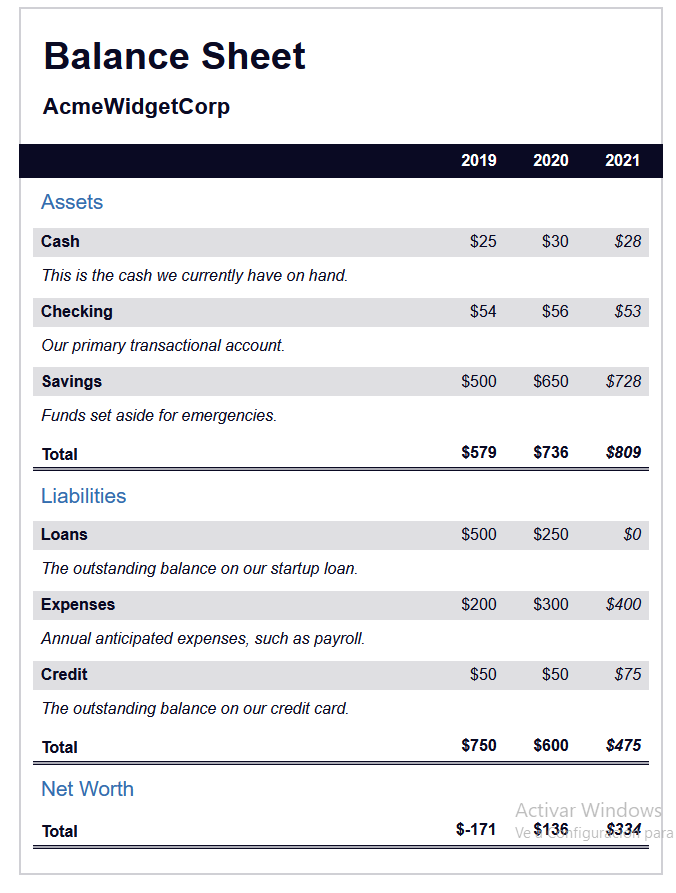

<div style="text-align: justify">

# Examples

## 1. A Piano

index.html: 

```html

```

styles.css: 

```css

```


<div style="margin: 10px auto; width: 100%;">
    <p></p>
</div>


## 2. A Technical Documentation Page

index.html: 

```html

```

styles.css: 

```css

```

</div>