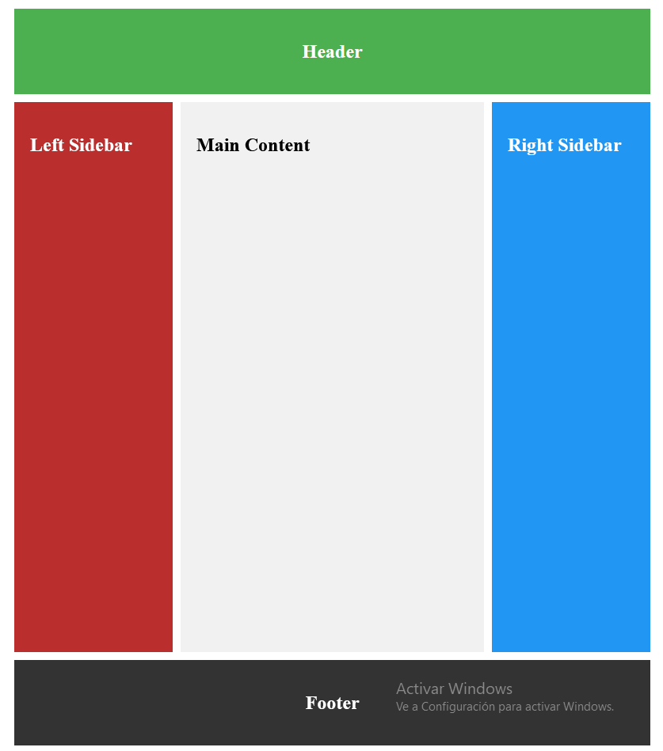

<div style="text-align: justify">

# 1. Working with CSS Grid

## 1.1. What is CSS Grid and how does it differ from Flexbox?

CSS Grid is a powerful layout system that allows web developers to create complex and responsive web page layouts with ease. 

Imagine you're arranging furniture in a room – CSS Grid is like having an invisible grid on your floor that helps you position everything precisely where you want it. When we build websites, we often need to arrange different elements on the page. Before CSS Grid, this was sometimes tricky, especially for complex layouts. CSS Grid simplifies this process by dividing your web page into rows and columns, creating a grid-like structure.

Let's imagine you were working with a container `div` with several items nested inside like this:

```html
<div class="container">
    <div class="item">Item 1</div>
    <div class="item">Item 2</div>
    <div class="item">Item 3</div>
    <div class="item">Item 4</div>
    <div class="item">Item 5</div>
    <div class="item">Item 6</div>
</div>
```

If you wanted to style those elements in a grid format, you can set the `display` to `grid` and apply columns like this:

- ```css
    .container {
        display: grid;
        grid-template-columns: 1fr 1fr 1fr;
        grid-gap: 20px;
    }

    .item {
        background-color: lightgray;
        padding: 20px;
        text-align: center;
        border: 1px solid #ccc;
    }
    ```

    In this code, we're telling the browser to create a grid with three equal-width columns, that's what the `1fr 1fr 1fr` means, and we're adding a 20-pixel gap between each grid item.

Now, you might be wondering: "What about Flexbox? Isn't that also used for layouts?" You're right! Flexbox is another CSS layout model, and it's quite useful too. But there are some key differences.

- Flexbox is one-dimensional, while Grid is two-dimensional. This means Flexbox works great for laying things out in a single row or column, while Grid excels at creating layouts with both rows and columns.

- Flexbox is content-first, meaning it adjusts the layout based on the content. Grid, on the other hand, is layout-first, allowing you to create the layout and then place items into it. Grid gives you more precise control over placement. You can tell an item exactly which row and column to occupy.

Here's a Flexbox example for comparison:

- ```css
    .container {
    display: flex;
    justify-content: space-between;
    }
    ```

    This creates a flex container where the items are spaced evenly along the main axis.

Both Grid and Flexbox have their strengths, and often, the best layouts use a combination of both. You might use Grid for the overall page layout, and then use Flexbox for aligning items within each grid area.

In summary, CSS Grid is a powerful tool that allows for precise, two-dimensional layouts. While it might seem complex at first, with practice, it becomes an invaluable tool for creating responsive and complex web layouts.


## 1.2. How can you create flexible grids with the `fr` unit?

Let's start with this HTML markup which is going to represent our grid container:

```html
<div class="grid-container">
    <div class="col"></div>
    <div class="col"></div>
    <div class="col"></div>
    <div class="col"></div>
</div>
```

Inside the CSS, we set the display property to grid for the container.

```css
html,
body {
    width: 100%;
    height: 100%;
}

.grid-container {
    display: grid;
    grid-template-columns: 25% 25% 25% 25%;
    gap: 15px;
    background-color: darkgray;
    height: 100%;
}

.col {
    background-color: darkslateblue;
}
```

`grid-template-columns` is used to set the size for each column. In this case, each column size will be `25%` of the container. Then the gap property is used to create space around each column.

So far we have been using percentages for the column size but we can also use the `fr` unit. The `fr` unit is a fractional unit which represents a fraction of the space for the grid container.

Here is what the code will look like when it is refactored to use `fr` units instead of percentages.

```css
html,
body {
    width: 100%;
    height: 100%;
}

.grid-container {
    display: grid;
    grid-template-columns: 1fr 1fr 1fr 1fr;
    gap: 15px;
    background-color: darkgray;
    height: 100%;
}

.col {
    background-color: darkslateblue;
}
```

Each column will take up one fraction of the available space. Since there are four columns, each column will have an equal share of the space available in the grid container.

As you start to build your grid layouts, you will find yourself wanting to use `fr` units more often because they provide a flexible, proportional way to distribute space, allowing you to create responsive layouts that adapt to varying screen sizes without needing to manually adjust pixel values.


## 1.3. How can you create gaps between tracks in a grid?

In the previous lecture videos, we talked a little bit about how to create space between grid items. But in this video, we will dive into more detail about how to use the `row-gap`, `column-gap` and `gap` properties in a grid layout.

But first we need to review what a track is in CSS grid. A **track** is the space between two neighboring grid lines. These lines are automatically created when you use CSS Grid. In this context, tracks generally refer to the rows and columns that make up the grid layout.

- To create gaps between columns in a CSS Grid, you can use the `column-gap` property. Acceptable values for this property include pixels, the `em` unit, percentages, or the `normal` keyword.

    > If you use the `normal` value for the `column-gap` property, then the result will be `0` for grid layouts and `1em` for multi-column layouts.

    Here is an example of the markup for a four column grid layout:

    ```html
    <div class="grid-container">
        <div></div>
        <div></div>
        <div></div>
        <div></div>
    </div>
    ```

    For the CSS, we set the display to grid and the `column-gap` property to 10 pixels:

    ```css
    .grid-container {
        display: grid;
        height: 100px;
        grid-template-columns: 1fr 1fr 1fr 1fr;
        column-gap: 10px;
    }

    .grid-container div {
        background-color: darkblue;
    }
    ```

- If we wanted to change the example to have two rows of blue boxes and create more space between the rows, we can use the `row-gap` property:

    ```css
    .grid-container {
        display: grid;
        grid-template-columns: 1fr 1fr;
        column-gap: 10px;
        row-gap: 30px;
    }

    .grid-container div {
        height: 100px;
        background-color: darkblue;
    }
    ```

    In this revised example, we are setting the `row-gap` property to 30 pixels and changing the `grid-template-columns` to use just two `1fr` units instead of four to create two rows of boxes.

    Just like the `column-gap` property, acceptable values for the `row-gap` property can include percentages, `em`, and pixels.

- If you want to use a shorthand for creating gaps between rows and columns, you can use the `gap` property. Here is the basic syntax:

    ```css
    gap: row-value optional-column-value;
    ```

    - If you specify one value for the `gap` property, then that value will be applied to both rows and columns. 

    - If you specify two values, then the first value will go to the row and the second will be applied to the column:

    ```css
    .grid-container {
        display: grid;
        grid-template-columns: 1fr 1fr;
        gap: 30px 10px;
    }

    .grid-container div {
        height: 100px;
        background-color: darkblue;
    }
    ```

    Acceptable values for the `gap` shorthand property include percentages, pixels, `em` and even `calc()` values. But you cannot use `fr` units here.

The `row-gap`, `column-gap`, and `gap` properties provide flexible ways to control spacing between items in a CSS Grid layout. By using these properties, you can easily create visually appealing grids with consistent and adjustable gaps between rows and columns.


## 1.4. How can you repeat track listings in a grid layout?

In the previous lecture videos, we have been working with the `grid-template-columns` property and setting the value to a few fractional units.

```css
.grid-container {
    display: grid;
    grid-template-columns: 1fr 1fr 1fr 1fr;
    column-gap: 10px;
}
```

While the following code is completely valid, there is an easier way to repeat a section or all of your track listings.

The `repeat()` function is used to repeat a section or all of the tracks for columns or rows. This function takes in a repeat count and the tracks you wish to repeat.

Here is a revised version of the earlier example using the repeat function:

```css
.grid-container {
    display: grid;
    grid-template-columns: repeat(4, 1fr);
    column-gap: 10px;
}
```

There won't be a change for the styles in the browser, but this is a more concise way to write repeated values for the columns.

- The `repeat()` function will accept any valid pattern that you can use for rows or columns.

    In this example, we have HTML markup for a grid container:

    ```html
    <div class="grid-container">
        <div class="box"></div>
        <div class="box"></div>
        <div class="box"></div>
        <div class="box"></div>
    </div>
    ```

    Then we are using the `repeat()` function to set the first and third columns to 20 pixels and the second and fourth columns to one fractional unit.

    ```css
    .grid-container {
        display: grid;
        grid-template-columns: repeat(2, 20px 1fr);
        column-gap: 10px;
    }

    .grid-container div {
        height: 100px;
        background-color: darkblue;
    }
    ```

Sometimes, you might opt to write out each individual value instead of using the `repeat()` function. But there are times when this function comes in handy, especially when you want to repeat a particular pattern for a track listing.


## 1.5. What is the difference between an implicit and explicit grid?

Implicit grid refers to the rows and columns automatically created by the browser when placing items in a grid layout – those not explicitly defined using `grid-template-rows` or `grid-template-columns`.

The properties that control the columns and rows created implicitly by the browser are `grid-auto-columns` and `grid-auto-rows`.

Implicit grid also refers to the additional rows and columns the browser automatically generates when you place an item outside the explicitly defined rows and columns.

For instance, let's say you define only two explicit columns in a grid layout this way:

```css
.grid-container {
    display: grid;
    grid-template-columns: 100px 100px; /* Only 2 explicit columns */
}

.grid-item {
    background-color: burlywood;
    border: 1px solid orangered;
    padding: 0.5rem;
    margin: 0.5rem;
}
```

But you have six items in the grid container:

```html
<div class="grid-container">
    <div class="grid-item">Item 1</div>
    <div class="grid-item">Item 2</div>
    <div class="grid-item">Item 3</div>
    <div class="grid-item">Item 4</div>
    <div class="grid-item">Item 5</div>
    <div class="grid-item">Item 6</div>
</div>
```

What happened?

- Two items filled the first row using the two explicit columns – `Item 1` in the first column and `Item 2` in the second column.

- The next items start a new row with `Item 3` going in the first column of the second row and `Item 4` in the second column of the second row, and so on.

As you've already seen, explicit grids are the areas of the grid you intentionally set up. That is, the rows and columns you explicitly define for a grid layout using the `grid-template-rows` and `grid-template-columns` properties.

Here is a table summarizing the differences between implicit and explicit grids:

| **Feature** | **Explicit Grid** | **Implicit Grid** |
| --- | --- | --- |
| **Size control** | Fully customizable using `grid-template-rows` and `grid-template-columns` . | Controlled by `grid-auto-rows` and `grid-auto-columns` , or defaults to `auto` . |
| **Default Behavior** | Does not change unless explicitly defined. | Automatically adapts to items placed outside the explicit grid. |
| **Complexity** | Requires more planning for layout structure. | Easier to implement for unstructured or variable content. |
| **Flexibility** | Rigid structure with defined rows and columns. | Flexible and adapts to dynamically placed content. |
| **Performance** | Potentially more performant as the layout is predefined. | May require additional browser computations for implicit grid generation. |
| **Use case** | Useful when the grid structure is predictable and defined upfront. | Useful for dynamic layouts where content is unknown or changes frequently. |


## 1.6. What is the `minmax()` function and how does it work?

The `minmax()` function defines the range for the size of a grid track, specifying how much space a row or column can occupy. Remember that you can set the track size with units like `px` (pixels), `rem`, or even `em`, and with fractional units (`fr`).

The `minmax()` function takes things a bit further by allowing you to set a minimum size and a maximum size for the grid track.

Here's the syntax of the `minmax()` function:

```css
minmax(min, max)
```

`min` is the minimum size of the grid track, which can be set using pixels, percentage, or `auto`. And `max` is the maximum size of the grid track which you can set with the same units.

The two values work together this way:

- The `min` value ensures the grid track will never shrink below a set size.

- The `max` value limits how large the grid track can grow.
    

The grid track size adjusts dynamically between the `min` and `max` values based on content and container size.

Let's look at a practical example with this HTML:

```html
<div class="grid-container">
    <div>
        <h2>Item 1</h2>
    </div>
    <div>
        <h2>Item 2</h2>
    </div>
</div>
```

And the grid CSS:

```css
.grid-container {
    display: grid;
    grid-template-columns: minmax(150px, 300px) 1fr;
    gap: 20px;
}

.grid-container > div {
    background: crimson;
    padding: 20px;
    text-align: center;
}
```

What's happening here? 

- The first `column, minmax(150px, 300px)`, will always be at least `150px` and at most `300px`, depending on the available space.

- On the other other hand, the second column, `1fr`, will take up any available remaining space in the grid container since there are no additional columns to share the space with.

The advantage of the `minmax()` function over fixed sizes and even `fr` units is that it is more flexible, making it ideal for adaptability and responsiveness.


## 1.7. How do the `grid-column` and `grid-row` properties work?

The `grid-column` and `grid-row` properties let you specify the horizontal and vertical placement of grid items within a grid layout.

In other words, they both allow you to control where a grid item begins and ends by referencing grid lines. These grid lines are the boundaries that separate rows and columns you have already defined using the `grid-template-rows` and `grid-template-columns` properties.

Let's take a look at the syntaxes of both `grid-row` and `grid-column`, and also a practical example.

Here's the syntax of the `grid-row` property and of `grid-column`:

```css
grid-row: <start-line> / <end-line>;
grid-column: <start-line> / <end-line>;
```

- `<start-line>` is the grid line where the item starts
- `<end-line>` is the grid line where the item ends. 
- > Both are 1-indexed, that is, you start counting them from 1, not 0.

Remember, grid lines for rows are generated based on the number of rows specified in the `grid-template-rows` property. The same applies to columns with the `grid-template-columns` property.

For the practical example, let's start with the lines generated by the browser when you use both the `grid-template-rows` and the `grid-template-columns` properties.

This is the HTML for that example:

```html
<div class="grid">
    <div class="item1">1</div>
    <div class="item2">2</div>
    <div class="item3">3</div>
    <div class="item4">4</div>
</div>
```

Here's the CSS with four equal columns and three equal rows:

```css
.grid {
    display: grid;
    grid-template-columns: repeat(4, 1fr); /* 4 equal columns */
    grid-template-rows: repeat(3, 100px); /* 3 equal rows */
    gap: 10px;
}

.grid > div {
    display: grid;
    place-items: center;
    background: crimson;
    color: white;
    font-size: 4rem;
}
```

Inspecting the grid container (the class `grid`) shows that each row and column is bounded by two lines – a start line at the beginning of the row or column, and an end line at the end of the row or column.

You can target these lines to start using the `grid-row` and `grid-column` properties to determine where you should place an item.

- Here's how you can make the first grid item occupy the first two columns:

    ```css
    .item1 {
        grid-column: 1 / 3;
    }
    ```

    With this, you're saying the first grid item should start at column 1 and end just before column 3. The first item will now occupy two columns, and the fourth item gets pushed to the second row. Cool!

- If you also want the first item to occupy two rows, you can specify a `grid-row` of `1 / 3`:

    ```css
    .item1 {
        grid-column: 1 / 3;
        grid-row: 1 / 3;
    }
    ```

- You can also use the `span` keyword to tell the grid item which row and column to span across. For example, `1 / 3` is the same as `1 / span 2`:

    ```css
    .item1 {
        grid-column: 1 / span 2;
        grid-row: 1 / span 2;
    }
    ```

You can continue to apply this technique to any item on the grid and place them wherever you want. 

Continuing the process, here's how we made a masonry layout with the items.

This is the new HTML with three additional items:

```html
<div class="grid">
    <div class="item1">1</div>
    <div class="item2">2</div>
    <div class="item3">3</div>
    <div class="item4">4</div>
    <div class="item5">5</div>
    <div class="item6">6</div>
    <div class="item7">7</div>
</div>
```

The new CSS:

```css
.grid {
    display: grid;
    grid-template-columns: repeat(4, 1fr); /* 4 equal columns */
    grid-template-rows: repeat(4, 100px); /* 4 equal rows */
    gap: 10px;
}

.grid > div {
    display: grid;
    place-items: center;
    background: crimson;
    color: white;
    font-size: 4rem;
}

.item1 { grid-column: 1 / span 2; }
.item4 { grid-column: 1 / span 3; }
.item6 { grid-column: 1 / span 2; }
.item7 { grid-column: 3 / span 2; }
```


## 1.8. How can you position items on the grid using the `grid-template-areas` property?

The `grid-template-areas` property lets you design a visual grid layout by using named labels.

You then assign the labels to specific grid items using the grid-area property. So, in other words, those named labels are also called "grid area names".

Here's the basic syntax of the `grid-template-areas` property:

```css
grid-template-areas:
    'header header header'
    'left-sidebar main right-sidebar'
    'footer footer footer';
```

Here are the points to take away from the basic syntax:

- Values like `header` and `main` are the names of the grid areas.
    
- Each space-separated value within a string corresponds to a column.
    
- Each string represents a row in the grid.  

So, in the syntax, we have a 3 by 3 grid container.

- After defining the template, you then have to use the `grid-area` property and the named labels (or areas) as values to tell CSS that a specific element belongs in that area of the grid.

```css
.header {
    grid-area: header;
    background-color: #4caf50;
    padding: 20px;
    text-align: center;
    color: white;
}

.sidebar-left {
    grid-area: nav;
    background-color: #ba2e2e;
    padding: 20px;
    color: white;
}

.main {
    grid-area: content;
    background-color: #f1f1f1;
    padding: 20px;
}

.sidebar-right {
    grid-area: side;
    background-color: #2196f3;
    padding: 20px;
    color: white;
}

.footer {
    grid-area: footer;
    background-color: #333;
    color: white;
    text-align: center;
    padding: 20px;
}
```

- The `grid-area` property connects the grid item to the named region you define in the `grid-template-areas`.

    A popular way to demonstrate the capabilities of the `grid-template-areas` property is by creating the classic Holy Grail layout.

    If you don't know what it is, the Holy Grail layout is a web design pattern with a header, footer, two sidebars, and a main content area. It ensures the main content takes priority, while sidebars and other sections adjust responsively within the layout.

    Many solutions exist to implement the holy grail layout, but using `grid-template-areas` and the `grid-area` property is the most straightforward way to create it.

    Here's the HTML for the holy grail layout:

    ```html
    <div class="grid-container">
        <div class="header">
            <h2>Header</h2>
        </div>
        <div class="sidebar-left">
            <h2>Left Sidebar</h2>
        </div>
        <div class="main">
            <h2>Main Content</h2>
        </div>
        <div class="sidebar-right">
            <h2>Right Sidebar</h2>
        </div>
        <div class="footer">
            <h2>Footer</h2>
        </div>
    </div>
    ```

The only thing left to define to complete our Holy Graid is the container class:

```css
.grid-container {
    display: grid;

    grid-template-areas:
        "header header header"
        "nav content side"
        "footer footer footer";

    grid-template-columns: 200px 1fr 200px;
    grid-template-rows: auto 1fr auto;
    gap: 10px;

    height: 100vh;
    padding: 10px;
    box-sizing: border-box;
}
```

With all this code, we can produce the following Holy Graid:

<div style="margin: 10px auto; width: 100%;">
    <p></p>
</div>


Please note that both the `grid-template-areas` and `grid-area` properties can be used independently of each other.

The `grid-template-areas` property is specifically used to define a visual layout by mapping out named grid areas within the grid container.

On the other hand, the `grid-area` property is used to position individual grid items, either by specifying their row and column positions or by referencing the named areas defined with the `grid-template-areas` property.


</div>